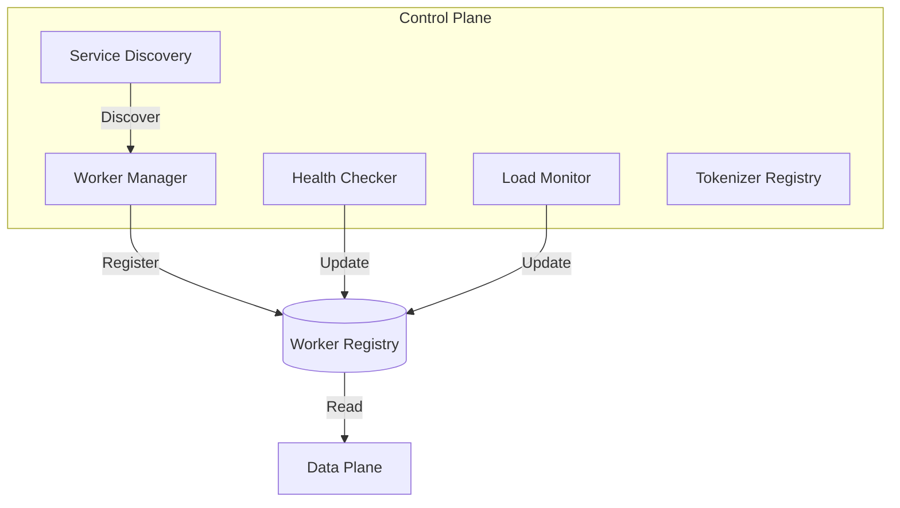
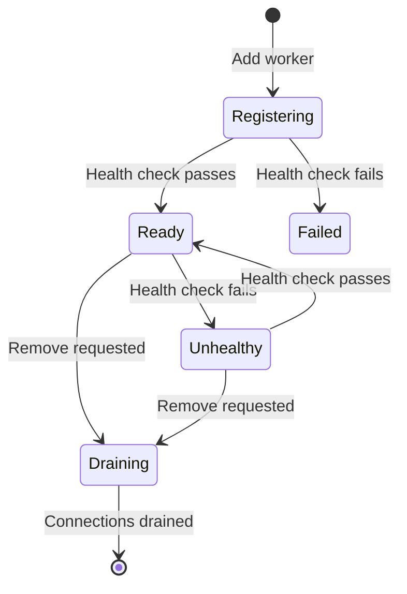
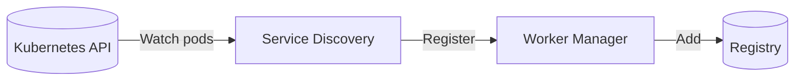

# Control Plane

The control plane manages the operational state of the gateway—tracking workers, monitoring health, and providing the data needed for routing decisions.

<div class="objectives" markdown>

#### What you'll learn

- How workers are registered and managed
- How health checking works
- How service discovery integrates with Kubernetes

</div>

---

## Overview

The control plane maintains a consistent view of:

- **Worker registry**: Which workers exist and their capabilities
- **Health status**: Which workers are healthy and ready
- **Load metrics**: Current request counts and queue depths



---

## Worker Manager

The Worker Manager handles the lifecycle of workers:

### Registration

Workers can be added:

- **Statically** via `--worker-urls` at startup
- **Dynamically** via the `/workers` API
- **Automatically** via Kubernetes service discovery

```bash
# Static registration
smg --worker-urls http://worker1:8000 http://worker2:8000

# Dynamic registration
curl -X POST http://localhost:30000/workers \
  -H "Content-Type: application/json" \
  -d '{"url": "http://worker3:8000"}'
```

### Capability Discovery

When a worker is registered, SMG queries its capabilities:

| Endpoint | Information |
|----------|-------------|
| `/get_server_info` | Server version, features |
| `/get_model_info` | Loaded model, context length |
| `/health` | Readiness status |

### Worker States



---

## Health Checker

The Health Checker continuously monitors worker health.

### How It Works

1. **Periodic probes**: Every `--health-check-interval-secs` (default: 30s)
2. **Timeout handling**: Probes timeout after `--health-check-timeout-secs` (default: 10s)
3. **Threshold logic**: Workers marked unhealthy after consecutive failures

### Configuration

| Parameter | Default | Description |
|-----------|---------|-------------|
| `--health-check-interval-secs` | 30 | Time between health checks |
| `--health-check-timeout-secs` | 10 | Health check timeout |
| `--health-success-threshold` | 2 | Successes to mark healthy |
| `--health-failure-threshold` | 3 | Failures to mark unhealthy |

### Health States

| State | Meaning | Receives Traffic |
|-------|---------|------------------|
| **Healthy** | Passing health checks | Yes |
| **Unhealthy** | Failing health checks | No |
| **Unknown** | Not yet checked | No |

---

## Load Monitor

The Load Monitor tracks real-time load on each worker:

### Metrics Tracked

| Metric | Description |
|--------|-------------|
| **Active requests** | Requests currently being processed |
| **Queue depth** | Requests waiting to be processed |
| **Response times** | Recent latency measurements |

### Usage

Load metrics inform routing decisions. For example, the `power_of_two` policy samples two workers and picks the one with lower load.

---

## Service Discovery

In Kubernetes environments, SMG can automatically discover workers.

### How It Works



1. SMG watches pods matching label selectors
2. New pods are automatically registered
3. Deleted pods are automatically removed

### Configuration

```bash
smg \
  --service-discovery \
  --selector app=sglang-worker \
  --service-discovery-namespace inference \
  --service-discovery-port 8000
```

### Required RBAC

```yaml
apiVersion: rbac.authorization.k8s.io/v1
kind: Role
metadata:
  name: smg-discovery
rules:
  - apiGroups: [""]
    resources: ["pods"]
    verbs: ["get", "list", "watch"]
```

### Prefill-Decode Discovery

For PD mode, use separate selectors:

```bash
smg \
  --service-discovery \
  --pd-disaggregation \
  --prefill-selector app=sglang,component=prefill \
  --decode-selector app=sglang,component=decode
```

---

## Tokenizer Registry

The Tokenizer Registry manages tokenizers for gRPC routing.

### Purpose

When using gRPC workers, SMG tokenizes requests before sending. The registry:

- Loads tokenizers from HuggingFace or local paths
- Caches tokenized prefixes for efficiency
- Supports dynamic tokenizer registration

### Configuration

```bash
# Specify tokenizer at startup
smg --model-path meta-llama/Llama-3.1-8B-Instruct

# Or register dynamically
curl -X POST http://localhost:30000/v1/tokenizers \
  -H "Content-Type: application/json" \
  -d '{"name": "llama3", "source": "meta-llama/Llama-3.1-8B-Instruct"}'
```

---

## What's Next?

- [Data Plane](data-plane.md) — How requests are routed
- [Load Balancing](../routing/load-balancing.md) — Routing policies
- [Kubernetes Deployment](../../tasks/deployment/kubernetes.md) — Service discovery in practice
