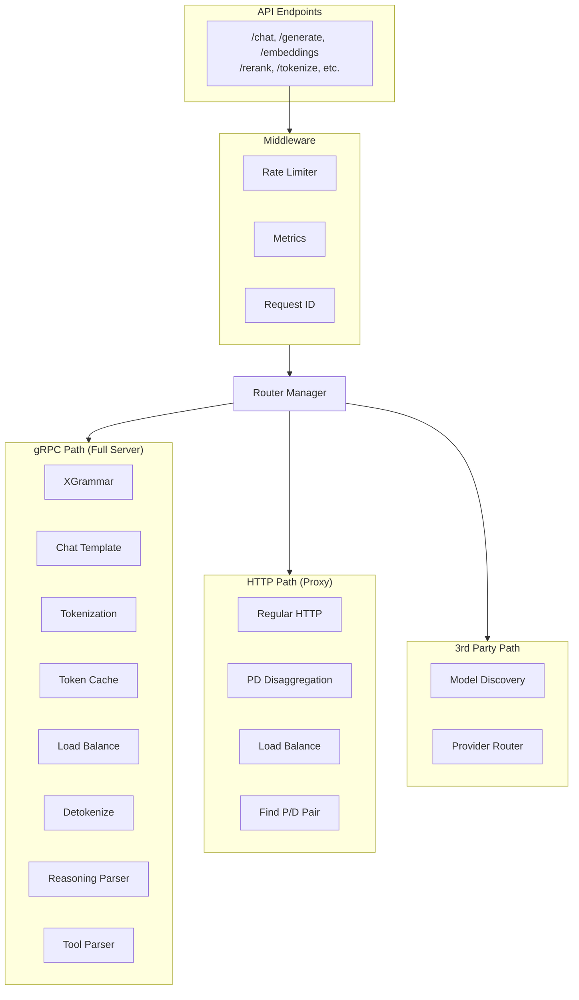
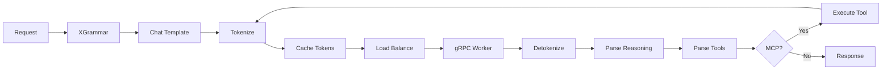
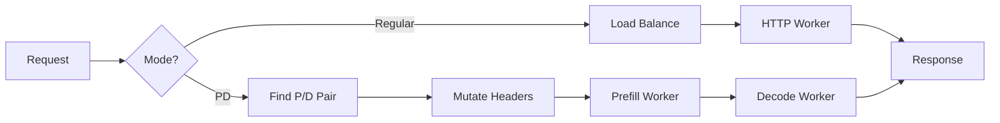
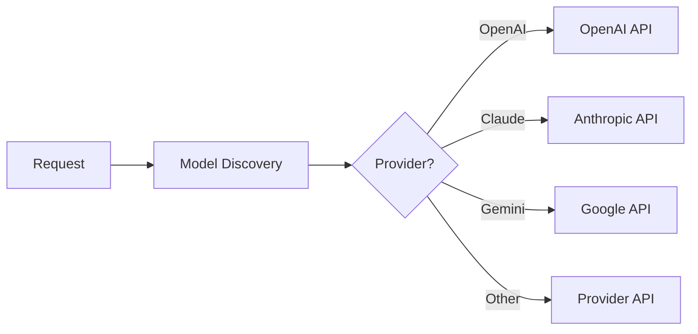
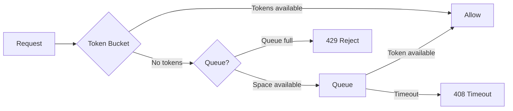
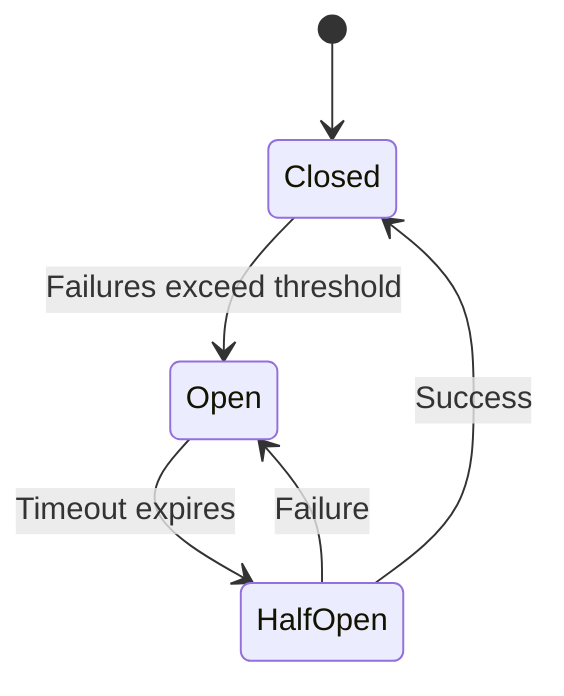
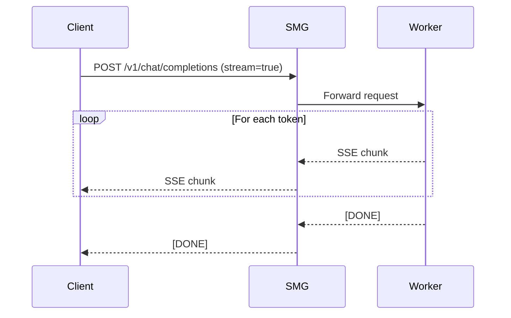
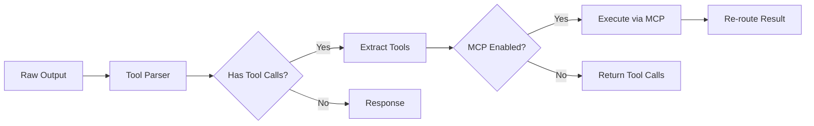

# Data Plane

The data plane handles every request that flows through SMG. Depending on your worker configuration, SMG can operate as a simple proxy or a full OpenAI-compatible server.

<div class="objectives" markdown>

#### What you'll learn

- The three routing paths: gRPC, HTTP, and 3rd Party
- What processing happens at the gateway vs. worker
- How streaming and response processing work

</div>

---

## Overview

The data plane routes requests through one of three paths based on worker type:



---

## Routing Paths

### gRPC Path (Full Server Mode)

When workers communicate via gRPC, SMG becomes a **complete OpenAI-compatible server**. The gateway handles all request processing:



**Gateway handles:**

| Stage | Function |
|-------|----------|
| **XGrammar** | Generate grammar for structured outputs |
| **Chat Template** | Apply model-specific chat formatting |
| **Tokenization** | Convert text to tokens (with caching) |
| **Token Cache** | Cache prefix tokens for routing decisions |
| **Load Balance** | Select worker based on cached tokens |
| **Detokenization** | Convert tokens back to text |
| **Reasoning Parser** | Extract chain-of-thought and reasoning |
| **Tool Parser** | Parse function/tool calls |
| **MCP Handler** | Execute MCP tool calls and re-route |

**Worker handles:** Raw token-level inference only

### HTTP Path (Proxy Mode)

When workers use HTTP, SMG acts as an **intelligent proxy**:



**Regular HTTP:**

- Simple load balancing and health checks
- Worker handles full OpenAI server functionality
- Gateway provides reliability (retries, circuit breakers)

**Prefill-Decode (PD) Disaggregation:**

- Separate workers for prefill and decode phases
- Gateway finds optimal P/D pairs
- Coordinates KV cache transfer between workers
- Optimizes TTFT and TPOT separately

### 3rd Party Path (External Providers)

Routes requests to external model providers:



**Supported providers:**

- OpenAI, Anthropic (Claude), Google (Gemini)
- xAI, TogetherAI, Groq
- AWS Bedrock, OCI
- Regional providers (讯飞, 腾讯)

---

## Request Pipeline

Every request passes through common middleware before path-specific processing:

### 1. API Handler

SMG accepts requests via multiple endpoints:

| Category | Endpoints |
|----------|-----------|
| **Inference** | `/chat`, `/generate`, `/responses`, `/rerank`, `/embeddings` |
| **Utility** | `/tokenize`, `/detokenize`, `/parser/tool`, `/parser/reasoning` |
| **Admin** | `/workers`, `/tokenizers`, `/wasm`, `/mcp` |

The API handler parses the request and routes to the appropriate path.

### 2. Rate Limiter

The rate limiter enforces request limits:



Configuration:

```bash
smg \
  --rate-limit-tokens-per-second 100 \
  --queue-size 50 \
  --queue-timeout-secs 30
```

### 3. Load Balancer

The load balancer selects a worker based on the configured policy:

| Policy | Algorithm |
|--------|-----------|
| `random` | Uniform random selection |
| `round_robin` | Sequential rotation |
| `power_of_two` | Sample two, pick lighter |
| `cache_aware` | Prefix matching + load |

[Learn more about Load Balancing →](../routing/load-balancing.md)

### 4. Circuit Breaker

The circuit breaker prevents routing to failing workers:



[Learn more about Circuit Breakers →](../reliability/circuit-breakers.md)

### 5. Retry Handler

Failed requests may be retried:

- **Retryable errors**: 408, 429, 500, 502, 503, 504
- **Exponential backoff**: Delays increase between retries
- **Jitter**: Random variation prevents thundering herd

---

## Streaming

SMG fully supports streaming responses for chat completions.

### How It Works



### Server-Sent Events

Streaming uses SSE format:

```
data: {"choices":[{"delta":{"content":"Hello"}}]}

data: {"choices":[{"delta":{"content":" world"}}]}

data: [DONE]
```

### Backpressure

SMG handles backpressure automatically:

- If the client is slow, SMG buffers chunks
- If the buffer fills, backpressure is applied to the worker
- Workers that support flow control will slow down

---

## Why Choose Each Mode?

### gRPC Mode Benefits

| Aspect | Benefit |
|--------|---------|
| **Gateway Tokenization** | Fast Rust tokenization with caching |
| **Token-Level Streaming** | True token-by-token streaming |
| **Optimal Routing** | Cache-aware routing with actual token data |
| **Centralized Logic** | MCP, tools, reasoning at gateway |
| **Backend Flexibility** | Workers only do inference |

### HTTP Mode Benefits

| Aspect | Benefit |
|--------|---------|
| **Simplicity** | Workers handle full OpenAI compatibility |
| **Existing Deployments** | Works with standard vLLM/SGLang HTTP servers |
| **Less Gateway Load** | Processing distributed to workers |

### PD Disaggregation Benefits

| Aspect | Benefit |
|--------|---------|
| **Optimized TTFT** | Dedicated prefill workers |
| **Optimized TPOT** | Dedicated decode workers |
| **Better Utilization** | Right-size workers for each phase |
| **Scalability** | Scale prefill and decode independently |

---

## Response Processing (gRPC Mode)

In gRPC mode, the gateway handles sophisticated response processing:

### Tool/Function Parsing



The gateway parses model outputs to:

- Detect function/tool call patterns
- Extract structured tool arguments
- Execute tools via MCP if configured
- Re-route tool results back through inference

### Reasoning Parser

For models with chain-of-thought:

- Extracts reasoning steps from output
- Separates thinking from final response
- Formats structured reasoning blocks

---

## Connection Management

SMG maintains connection pools to workers:

### HTTP Connections

- **Keep-alive**: Connections are reused
- **Pool size**: Configurable per worker
- **Health**: Bad connections are removed

### gRPC Connections

- **Multiplexing**: Multiple requests per connection
- **Reconnection**: Automatic reconnection on failure
- **Load balancing**: Client-side load balancing

---

## Error Handling

SMG handles errors at multiple levels:

| Error Type | Handling |
|------------|----------|
| **Network error** | Retry with different worker |
| **Timeout** | Retry or return 504 |
| **Worker error (5xx)** | Retry based on status code |
| **Client error (4xx)** | Return to client immediately |
| **Rate limit** | Queue or return 429 |

---

## Metrics

The data plane exports detailed metrics:

| Metric | Description |
|--------|-------------|
| `smg_http_requests_total` | Total requests by endpoint |
| `smg_http_request_duration_seconds` | Request latency histogram |
| `smg_router_ttft_seconds` | Time to first token |
| `smg_router_tpot_seconds` | Time per output token |

[View all metrics →](../../reference/metrics.md)

---

## What's Next?

- [Load Balancing](../routing/load-balancing.md) — Routing policies in depth
- [Circuit Breakers](../reliability/circuit-breakers.md) — Failure handling
- [Metrics Reference](../../reference/metrics.md) — Complete metrics list
