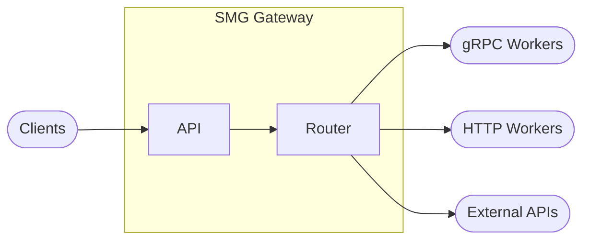
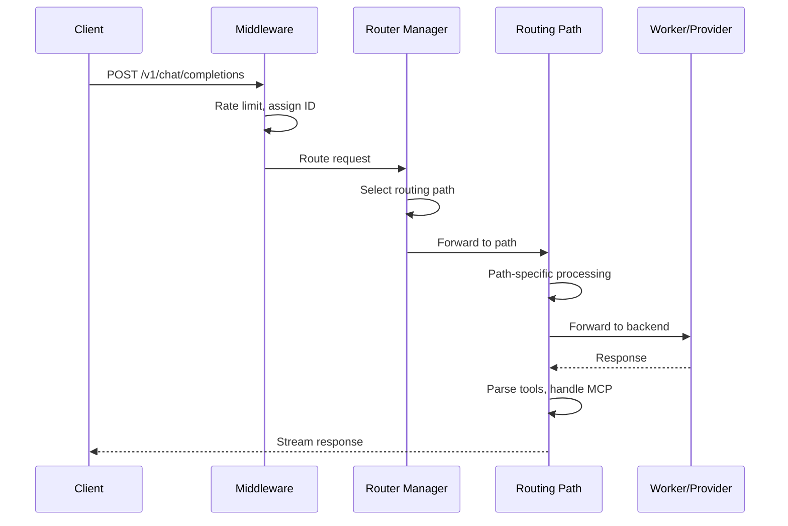
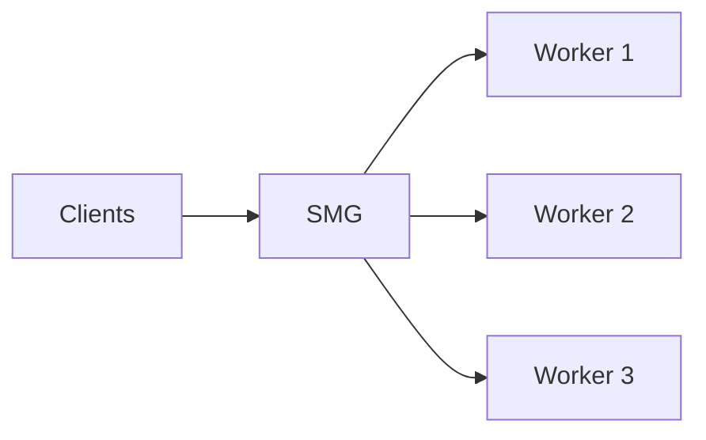
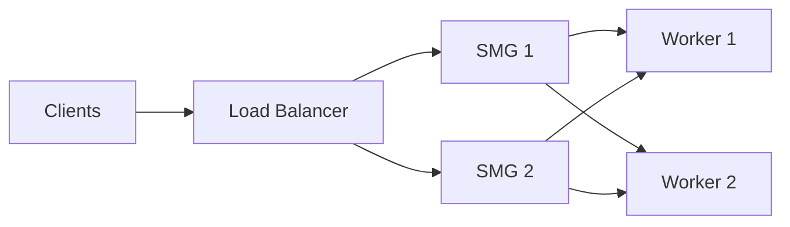
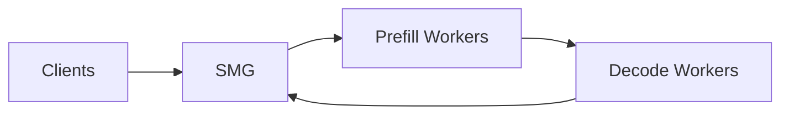

# Architecture Overview

This page describes the high-level architecture of Shepherd Model Gateway.

#### What you'll learn

- How SMG adapts to different worker types
- The role of registries, control plane, and data plane
- Request flow through the gateway

---

## System Architecture

SMG adapts its behavior based on worker type:

| Worker Type | Gateway Behavior |
|-------------|------------------|
| **gRPC** | Full server — tokenization, chat templates, tool parsing, MCP, detokenization |
| **HTTP** | Proxy — load balancing, health checks, PD disaggregation |
| **External** | Router — model discovery, provider abstraction |

---

## Internal Components

### Registries

| Registry | Purpose |
|----------|---------|
| **Model** | Available models and backend mappings |
| **Tokenizer** | Tokenizers for gateway-side processing (gRPC mode) |
| **LB Policy** | Load balancing configurations |
| **Chat History** | Multi-turn conversation context |
| **WASM Plugins** | Custom logic extensions |

---

## Control Plane

The control plane manages the **operational state** of the system. It doesn't handle user requests directly but maintains the information needed for routing decisions.

### Components

| Component | Function |
|-----------|----------|
| **Worker Manager** | Registers workers, tracks capabilities, manages lifecycle |
| **Health Checker** | Probes workers periodically, updates health status |
| **Service Discovery** | Discovers workers in Kubernetes via pod selectors |
| **Load Monitor** | Tracks active requests and queue depths per worker |

The control plane answers questions like:

- Which workers are available?
- How healthy is each worker?
- What's the current load on each worker?

[Learn more about the Control Plane →](control-plane.md)

---

## Data Plane

The data plane handles **every user request**. It must be fast, reliable, and correct.

### Routing Paths

| Path | Protocol | Use Case |
|------|----------|----------|
| **gRPC Router** | gRPC | Token-level streaming with gateway-side tokenization |
| **HTTP Router** | HTTP | OpenAI-compatible passthrough |
| **3rd Party Router** | HTTP | External provider routing (OpenAI, Anthropic, etc.) |

### Middleware Components

| Component | Function |
|-----------|----------|
| **Rate Limiter** | Enforces request limits with token bucket algorithm |
| **Circuit Breaker** | Prevents routing to failing workers |
| **Retry Handler** | Retries failed requests with exponential backoff |
| **Metrics Collector** | Records latency, throughput, and error rates |

### Response Processing

| Component | Function |
|-----------|----------|
| **Tool Parser** | Extracts function/tool calls from model outputs |
| **Reasoning Parser** | Parses chain-of-thought and structured reasoning |
| **MCP Handler** | Model Context Protocol for tool execution loops |

The data plane answers questions like:

- Which routing path should this request use?
- Which worker should handle this request?
- Should this request be retried?
- Is the client within rate limits?

[Learn more about the Data Plane →](data-plane.md)

---

## Request Flow

Here's how a typical request flows through SMG:

### Step by Step

1. **Middleware Processing**: Request passes through rate limiting, gets assigned a request ID, and metrics are recorded.

2. **Path Selection**: Router manager determines which routing path to use (gRPC, HTTP, or 3rd Party).

3. **Path-Specific Processing**:
   - **gRPC**: Apply chat template, tokenize, cache tokens, load balance
   - **HTTP**: Regular or Prefill-Decode mode, load balance
   - **3rd Party**: Model discovery, provider routing

4. **Backend Communication**: Request is forwarded to the appropriate backend or external provider.

5. **Response Processing**: Tools are parsed, MCP handlers execute if needed, response is built and streamed.

---

## Deployment Topologies

SMG supports several deployment patterns:

### Single Gateway

The simplest topology with one SMG instance routing to multiple workers.

**Best for**: Development, small deployments

### High Availability

Multiple SMG instances behind a load balancer.

**Best for**: Production deployments requiring HA

### Prefill-Decode Disaggregation

Separate workers for prefill and decode phases.

**Best for**: High-throughput deployments optimizing for TTFT and TPOT

---

## What's Next?

- [Control Plane](control-plane.md) — Deep dive into worker management
- [Data Plane](data-plane.md) — Deep dive into request routing
- [Load Balancing](../routing/load-balancing.md) — Understand routing policies
