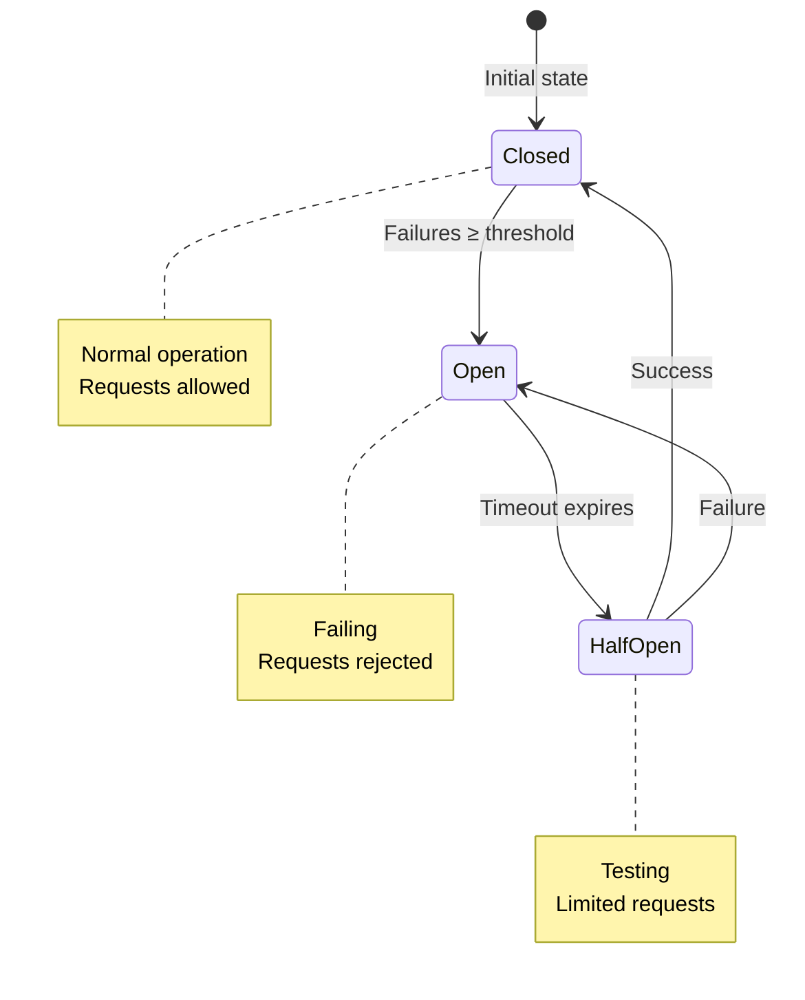
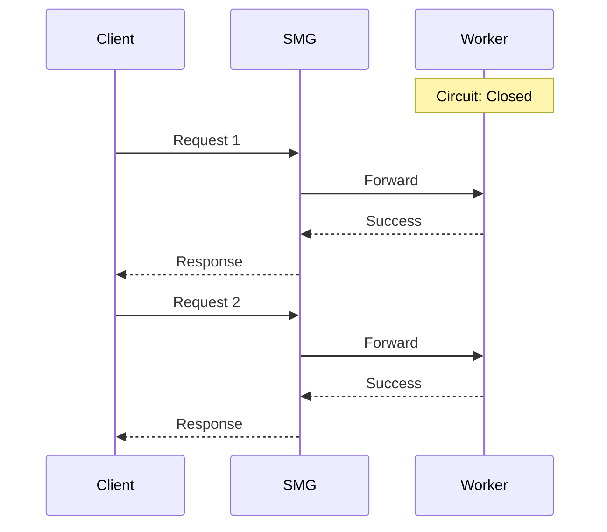
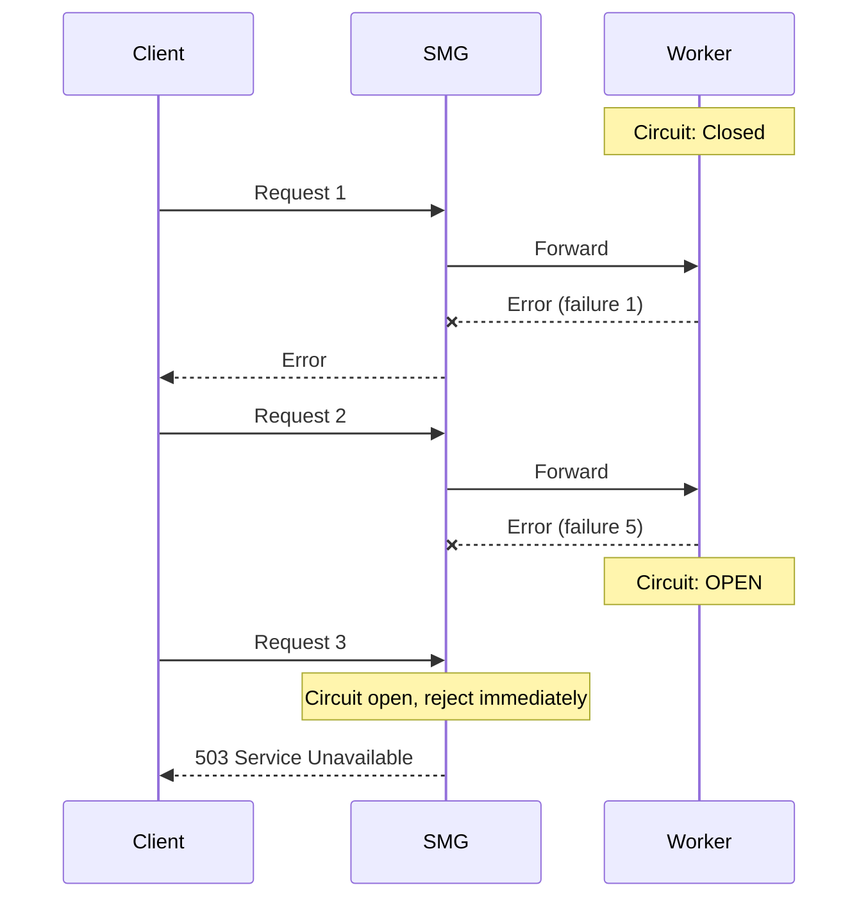
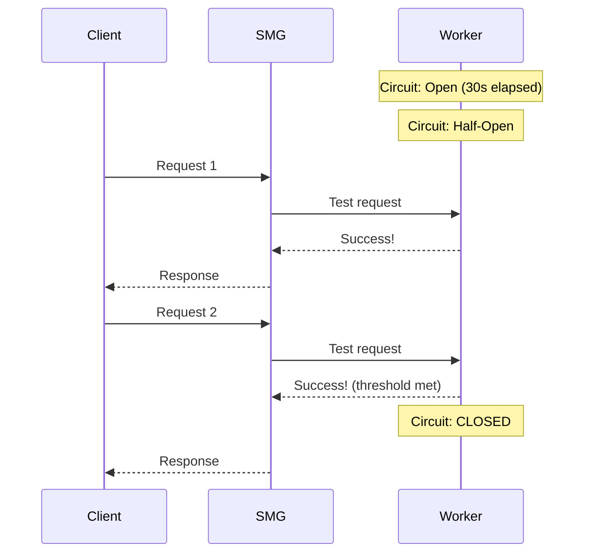

# Circuit Breakers

Circuit breakers prevent cascade failures by stopping traffic to unhealthy workers. They're essential for maintaining system stability when workers fail.

<div class="objectives" markdown>

#### What you'll learn

- How circuit breakers protect your system
- The three circuit breaker states
- How to configure circuit breaker behavior

</div>

---

## Why Circuit Breakers?

Without circuit breakers, a failing worker can cause:

1. **Wasted requests**: Requests sent to failing workers timeout
2. **Increased latency**: Clients wait for timeouts before retry
3. **Resource exhaustion**: Connections pile up to dead workers
4. **Cascade failures**: Retry storms overwhelm remaining workers

Circuit breakers **fail fast**—they detect failing workers and stop sending traffic immediately.

---

## How It Works

Each worker has its own circuit breaker with three states:



### States

| State | Behavior |
|-------|----------|
| **Closed** | Normal operation. Requests flow to worker. Failures are counted. |
| **Open** | Worker is failing. Requests are **immediately rejected** without attempting the worker. |
| **Half-Open** | Testing recovery. A **limited number** of requests are allowed through. Success closes the circuit; failure reopens it. |

---

## State Transitions

### Closed → Open

The circuit **opens** when:

```
consecutive_failures >= failure_threshold
```

Within the sliding window (`--cb-window-duration-secs`).

### Open → Half-Open

After the circuit has been open for `--cb-timeout-duration-secs`, it transitions to half-open to test if the worker has recovered.

### Half-Open → Closed

If `--cb-success-threshold` consecutive requests succeed, the circuit closes and normal operation resumes.

### Half-Open → Open

If any request fails during half-open, the circuit immediately reopens.

---

## Configuration

```bash
smg \
  --worker-urls http://w1:8000 http://w2:8000 \
  --cb-failure-threshold 5 \
  --cb-success-threshold 2 \
  --cb-timeout-duration-secs 30 \
  --cb-window-duration-secs 60
```

### Parameters

| Parameter | Default | Description |
|-----------|---------|-------------|
| `--cb-failure-threshold` | 5 | Failures to open circuit |
| `--cb-success-threshold` | 2 | Successes to close from half-open |
| `--cb-timeout-duration-secs` | 30 | Time before testing recovery |
| `--cb-window-duration-secs` | 60 | Sliding window for counting failures |
| `--disable-circuit-breaker` | false | Disable circuit breakers entirely |

### Tuning Guidelines

| Scenario | Recommendation |
|----------|---------------|
| **Flaky workers** | Higher `failure_threshold`, shorter `timeout` |
| **Critical availability** | Lower `failure_threshold`, longer `timeout` |
| **Fast recovery workers** | Lower `timeout`, lower `success_threshold` |
| **Slow recovery workers** | Higher `timeout`, higher `success_threshold` |

---

## Example Scenarios

### Normal Operation



### Worker Fails



### Recovery



---

## Monitoring

Track circuit breaker state with Prometheus:

```promql
# Current circuit breaker states
# 0 = closed, 1 = open, 2 = half-open
smg_worker_cb_state

# Workers with open circuits
count(smg_worker_cb_state == 1)

# State transitions
rate(smg_worker_cb_transitions_total[5m])

# Consecutive failures per worker
smg_worker_cb_consecutive_failures
```

### Alerting Example

```yaml
groups:
  - name: smg-circuit-breakers
    rules:
      - alert: CircuitBreakerOpen
        expr: smg_worker_cb_state == 1
        for: 1m
        labels:
          severity: warning
        annotations:
          summary: "Circuit breaker open for {{ $labels.worker_id }}"

      - alert: AllCircuitsOpen
        expr: count(smg_worker_cb_state == 1) == count(smg_worker_cb_state)
        for: 30s
        labels:
          severity: critical
        annotations:
          summary: "All worker circuit breakers are open"
```

---

## Interaction with Other Features

### Retries

When a circuit is **open**:

- Requests are rejected **immediately** (no retry to that worker)
- Other workers may be tried if available

When a circuit is **half-open**:

- Only a limited number of test requests are sent
- Failures don't count against retry budget

### Health Checks

Circuit breakers and health checks work together:

| Health Check | Circuit Breaker | Worker State |
|--------------|-----------------|--------------|
| Passing | Closed | Healthy, receiving traffic |
| Failing | Open | Unhealthy, no traffic |
| Passing | Open | Recovering, limited traffic |

---

## Disabling Circuit Breakers

In some cases, you may want to disable circuit breakers:

```bash
smg --worker-urls http://w1:8000 --disable-circuit-breaker
```

!!! warning "Not Recommended"
    Disabling circuit breakers removes an important safety mechanism. Only do this if you have another layer providing similar protection.

---

## What's Next?

- [Rate Limiting](rate-limiting.md) — Protecting workers from overload
- [Metrics Reference](../../reference/metrics.md) — Circuit breaker metrics
