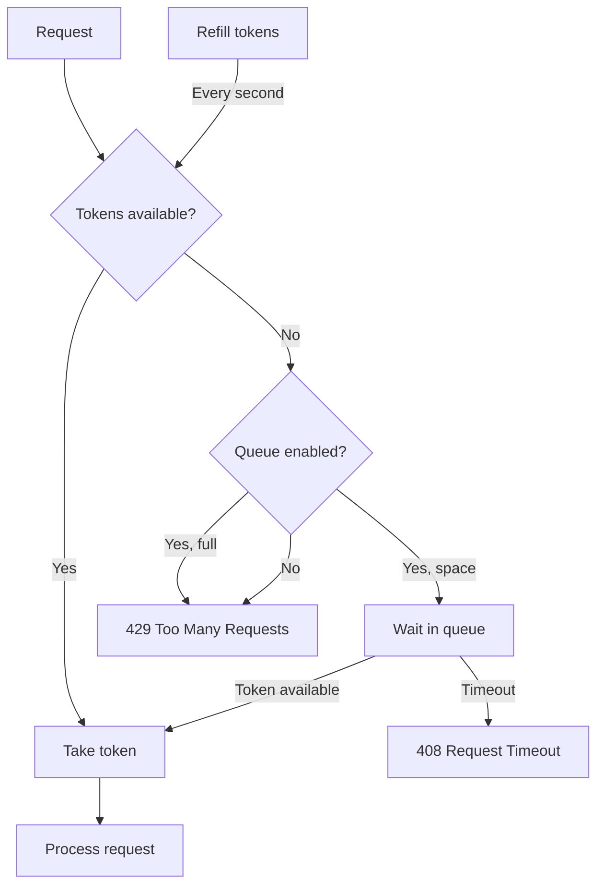

# Rate Limiting

Rate limiting protects workers from being overwhelmed by too many concurrent requests. SMG uses a token bucket algorithm with optional request queuing.

<div class="objectives" markdown>

#### What you'll learn

- How the token bucket algorithm works
- How request queuing prevents request loss
- How to configure rate limits for your workload

</div>

---

## Why Rate Limit?

Without rate limiting:

1. **Worker overload**: Too many concurrent requests degrade performance
2. **Memory exhaustion**: Workers run out of GPU memory
3. **Cascading timeouts**: Slow responses cause client timeouts
4. **Poor user experience**: Some users get fast responses, others wait forever

Rate limiting ensures **fair access** and **predictable performance**.

---

## How It Works

SMG uses a **token bucket** algorithm:



### Token Bucket

- **Bucket capacity**: Maximum concurrent requests (`--max-concurrent-requests`)
- **Refill rate**: Tokens added per second (`--rate-limit-tokens-per-second`)
- **Request cost**: Each request consumes one token

### Request Queue

When no tokens are available, requests can wait in a queue:

- **Queue size**: Maximum waiting requests (`--queue-size`)
- **Queue timeout**: Maximum wait time (`--queue-timeout-secs`)

---

## Configuration

```bash
smg \
  --worker-urls http://w1:8000 http://w2:8000 \
  --max-concurrent-requests 100 \
  --rate-limit-tokens-per-second 50 \
  --queue-size 200 \
  --queue-timeout-secs 30
```

### Parameters

| Parameter | Default | Description |
|-----------|---------|-------------|
| `--max-concurrent-requests` | -1 (unlimited) | Maximum concurrent requests |
| `--rate-limit-tokens-per-second` | 512 | Token refill rate |
| `--queue-size` | 128 | Maximum queued requests |
| `--queue-timeout-secs` | 30 | Maximum queue wait time |

---

## Response Codes

| Code | Meaning | When |
|------|---------|------|
| **429** | Too Many Requests | Queue is full |
| **408** | Request Timeout | Queue wait exceeded timeout |

### 429 Response

```json
{
  "error": {
    "message": "Rate limit exceeded. Please retry later.",
    "type": "rate_limit_error",
    "code": "rate_limit_exceeded"
  }
}
```

Includes `Retry-After` header with recommended wait time.

### 408 Response

```json
{
  "error": {
    "message": "Request timed out waiting in queue.",
    "type": "timeout_error",
    "code": "queue_timeout"
  }
}
```

---

## Sizing Guidelines

### Concurrent Requests

Base on worker capacity:

```
max_concurrent_requests = num_workers × requests_per_worker
```

| Worker Type | Requests per Worker |
|-------------|---------------------|
| Small GPU (16GB) | 4-8 |
| Medium GPU (40GB) | 8-16 |
| Large GPU (80GB) | 16-32 |

### Queue Size

Base on acceptable latency:

```
queue_size = max_concurrent_requests × queue_depth_factor
```

| Latency Tolerance | Queue Depth Factor |
|-------------------|-------------------|
| Low (interactive) | 0.5-1x |
| Medium (batch) | 2-4x |
| High (async) | 4-8x |

### Token Refill Rate

Base on sustainable throughput:

```
tokens_per_second = expected_requests_per_second × 1.2
```

The 1.2 factor provides headroom for bursts.

---

## Example Configurations

=== "Interactive API"

    Low latency, reject excess traffic:

    ```bash
    smg \
      --max-concurrent-requests 50 \
      --queue-size 25 \
      --queue-timeout-secs 5
    ```

=== "Batch Processing"

    Higher throughput, longer queues:

    ```bash
    smg \
      --max-concurrent-requests 200 \
      --queue-size 500 \
      --queue-timeout-secs 60
    ```

=== "No Rate Limiting"

    Trust upstream rate limiting:

    ```bash
    smg \
      --max-concurrent-requests -1
    ```

---

## Monitoring

Track rate limiting with Prometheus:

```promql
# Rate limit decisions
rate(smg_http_rate_limit_total[5m])

# By decision type
sum by (decision) (rate(smg_http_rate_limit_total[5m]))

# Queue depth
smg_queue_depth

# Queue wait time
histogram_quantile(0.99, rate(smg_queue_wait_seconds_bucket[5m]))
```

### Dashboard Queries

| Metric | Query |
|--------|-------|
| Rejection rate | `rate(smg_http_rate_limit_total{decision="rejected"}[5m])` |
| Queue utilization | `smg_queue_depth / smg_queue_size` |
| Average queue wait | `rate(smg_queue_wait_seconds_sum[5m]) / rate(smg_queue_wait_seconds_count[5m])` |

---

## Client-Side Handling

### Retry Strategy

Clients should implement exponential backoff when receiving 429:

```python
import time
import requests

def request_with_retry(url, data, max_retries=5):
    for attempt in range(max_retries):
        response = requests.post(url, json=data)

        if response.status_code == 429:
            retry_after = int(response.headers.get('Retry-After', 2 ** attempt))
            time.sleep(retry_after)
            continue

        return response

    raise Exception("Max retries exceeded")
```

### Adaptive Rate

Monitor 429 responses and adjust request rate:

```python
class AdaptiveClient:
    def __init__(self, base_rate=10):
        self.rate = base_rate

    def on_success(self):
        self.rate = min(self.rate * 1.1, 100)  # Increase slowly

    def on_rate_limit(self):
        self.rate = self.rate * 0.5  # Decrease quickly
```

---

## What's Next?

- [Circuit Breakers](circuit-breakers.md) — Handling worker failures
- [Metrics Reference](../../reference/metrics.md) — Rate limiting metrics
- [Monitoring Task](../../tasks/operations/monitoring.md) — Setting up dashboards
