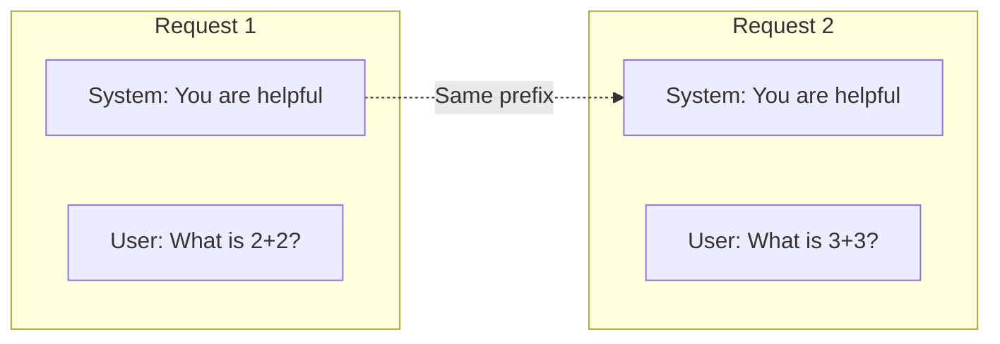
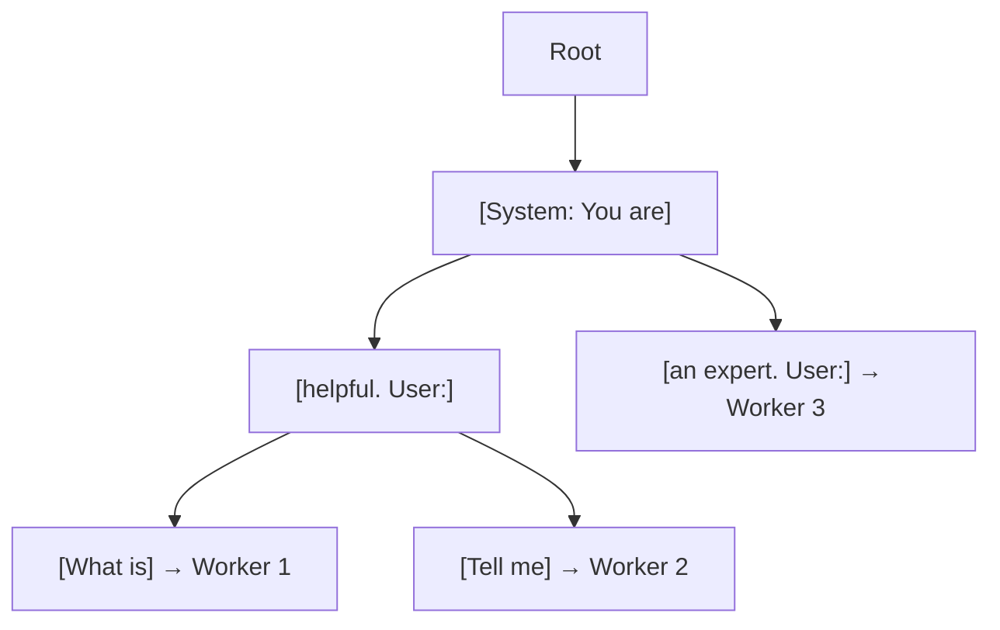

# Cache-Aware Routing

Cache-aware routing is SMG's most sophisticated load balancing policy. It maintains affinity between prompts and workers to maximize KV cache hits.

<div class="objectives" markdown>

#### What you'll learn

- How the radix tree tracks request prefixes
- How cache hits improve performance
- How to tune cache-aware parameters

</div>

---

## Why Cache-Aware?

LLM inference workers maintain a **KV cache** of previously computed attention states. When a new request shares a prefix with a previous request, the worker can skip recomputing that portion.



**If both requests go to the same worker**, the second request benefits from the cached prefix—reducing **Time to First Token (TTFT)** significantly.

---

## How It Works

### The Radix Tree

SMG maintains a radix tree (prefix tree) that maps token sequences to workers:



### Routing Algorithm

```python
def select_worker(request):
    tokens = tokenize(request.prompt)

    # Search radix tree for matching prefix
    match = radix_tree.find_longest_match(tokens)

    if match and match.ratio >= cache_threshold:
        worker = match.worker

        # Check if worker is overloaded
        if not is_overloaded(worker):
            return worker

    # Fall back to load-based selection
    return select_by_load(workers)
```

### Overload Detection

A worker is considered overloaded if:

```
load_diff > balance_abs_threshold
  OR
load_ratio > balance_rel_threshold
```

Where:
- `load_diff` = worker.load - min_load
- `load_ratio` = worker.load / min_load

---

## Configuration

### Parameters

| Parameter | Default | Description |
|-----------|---------|-------------|
| `--cache-threshold` | 0.3 | Minimum prefix match ratio for cache hit |
| `--balance-abs-threshold` | 64 | Absolute load difference before rebalancing |
| `--balance-rel-threshold` | 1.5 | Relative load ratio before rebalancing |
| `--eviction-interval-secs` | 120 | How often to prune the radix tree |
| `--max-tree-size` | 67108864 | Maximum nodes in the radix tree |

### Tuning Guidelines

#### Cache Threshold

| Value | Behavior |
|-------|----------|
| **Low (0.2)** | More cache hits, potential hot spots |
| **Default (0.3)** | Balanced |
| **High (0.5)** | Fewer cache hits, better load balance |

!!! tip "Recommendation"
    Start with default (0.3) and increase if you see hot spots.

#### Balance Thresholds

| Scenario | Recommendation |
|----------|---------------|
| Homogeneous workers | Higher thresholds (favor caching) |
| Heterogeneous workers | Lower thresholds (favor load balance) |
| Bursty traffic | Lower thresholds (prevent queuing) |

### Example Configurations

=== "High Cache Affinity"

    Maximize cache hits for conversational workloads:

    ```bash
    smg \
      --policy cache_aware \
      --cache-threshold 0.2 \
      --balance-abs-threshold 128 \
      --balance-rel-threshold 2.0
    ```

=== "Balanced"

    Default configuration:

    ```bash
    smg \
      --policy cache_aware \
      --cache-threshold 0.3 \
      --balance-abs-threshold 64 \
      --balance-rel-threshold 1.5
    ```

=== "Load-Focused"

    Prioritize load balance over caching:

    ```bash
    smg \
      --policy cache_aware \
      --cache-threshold 0.5 \
      --balance-abs-threshold 32 \
      --balance-rel-threshold 1.2
    ```

---

## Performance Impact

### Benchmarks

In typical conversational workloads:

| Metric | Without Cache-Aware | With Cache-Aware | Improvement |
|--------|---------------------|------------------|-------------|
| **TTFT (p50)** | 150ms | 45ms | 70% |
| **TTFT (p99)** | 800ms | 200ms | 75% |
| **Cache hit rate** | 0% | 65% | - |

!!! note
    Results vary based on workload characteristics. Workloads with diverse prompts will see smaller improvements.

### When Cache-Aware Helps Most

1. **Multi-turn conversations**: Same system prompt, growing context
2. **RAG applications**: Common document prefixes
3. **Batch processing**: Similar prompts in sequence
4. **Shared system prompts**: Multiple users with same instructions

### When Cache-Aware Helps Less

1. **Completely random prompts**: No prefix sharing
2. **Single-turn, diverse queries**: Each prompt is unique
3. **Very short prompts**: Prefix is too small to cache

---

## Memory Management

### Radix Tree Size

The radix tree grows with unique prefixes. Configure `--max-tree-size` based on:

| Memory | `--max-tree-size` | Unique Prefixes |
|--------|-------------------|-----------------|
| 1 GB | 16777216 | ~16M |
| 4 GB | 67108864 | ~64M (default) |
| 16 GB | 268435456 | ~256M |

### Eviction

SMG periodically evicts stale entries:

- **Interval**: `--eviction-interval-secs` (default: 120)
- **Strategy**: Least recently used (LRU)

---

## Monitoring

Track cache-aware performance with these metrics:

```promql
# Cache hit rate
rate(smg_router_cache_hits_total[5m]) /
rate(smg_router_requests_total[5m])

# Radix tree size
smg_router_cache_tree_size

# Load distribution
smg_worker_requests_active
```

---

## Multi-Gateway Considerations

When running multiple SMG instances:

- Each instance maintains its **own radix tree**
- Cache efficiency drops by **10-20%** compared to single instance
- Consider **session affinity** at the load balancer to improve cache hits

```nginx
upstream smg {
    hash $http_x_user_id consistent;  # Affinity by user
    server smg-1:30000;
    server smg-2:30000;
}
```

---

## What's Next?

- [Load Balancing](load-balancing.md) — Compare all routing policies
- [Metrics Reference](../../reference/metrics.md) — Cache-related metrics
