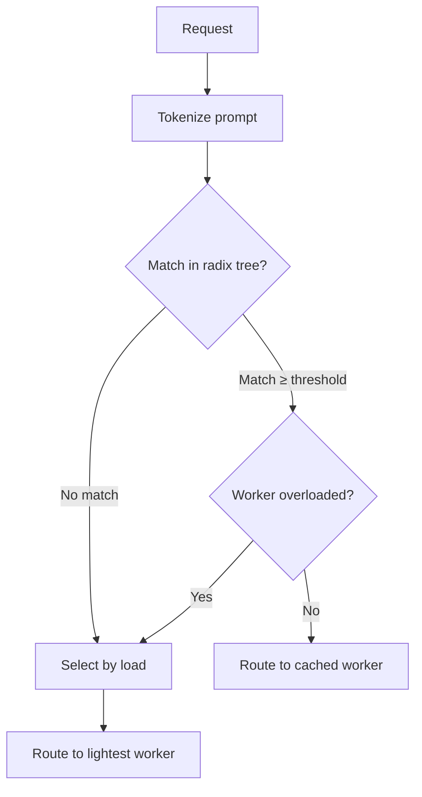
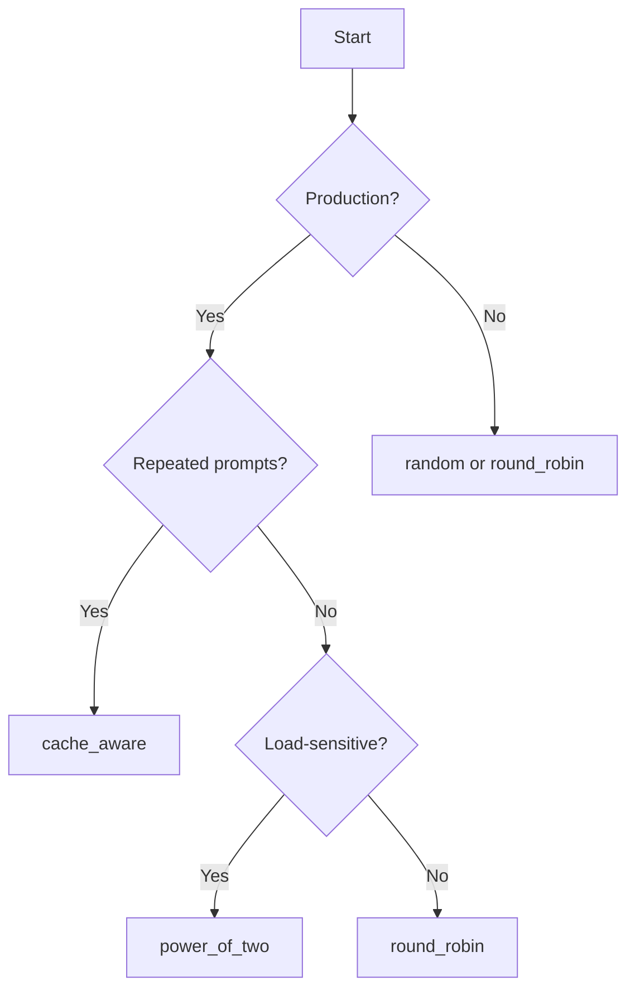

# Load Balancing

SMG provides multiple load balancing policies to distribute requests across workers. Choosing the right policy depends on your workload characteristics.

<div class="objectives" markdown>

#### What you'll learn

- Available load balancing policies
- When to use each policy
- How to configure load balancing

</div>

---

## Overview

The load balancer selects which worker handles each request. SMG provides five policies:

| Policy | Description | Best For |
|--------|-------------|----------|
| `random` | Uniform random selection | Testing, simple deployments |
| `round_robin` | Sequential rotation | Even distribution |
| `power_of_two` | Sample two, pick lighter | Load-sensitive routing |
| `cache_aware` | Prefix matching + load | **Production (default)** |
| `bucket` | Load-based grouping | Large clusters |

---

## Random

The simplest policy—each worker has equal probability of selection.

```bash
smg --worker-urls http://w1:8000 http://w2:8000 --policy random
```

### Algorithm

```
selected = workers[random(0, len(workers))]
```

### Characteristics

| Aspect | Value |
|--------|-------|
| **Complexity** | O(1) |
| **Load awareness** | No |
| **Cache affinity** | No |

!!! tip "When to use"
    Testing environments or when workers are completely homogeneous.

---

## Round Robin

Rotates through workers sequentially.

```bash
smg --worker-urls http://w1:8000 http://w2:8000 --policy round_robin
```

### Algorithm

```
counter = (counter + 1) % len(workers)
selected = workers[counter]
```

### Characteristics

| Aspect | Value |
|--------|-------|
| **Complexity** | O(1) |
| **Load awareness** | No |
| **Cache affinity** | No |

!!! tip "When to use"
    When all workers have equal capacity and you want predictable distribution.

---

## Power of Two

Samples two random workers and selects the one with lower load.

```bash
smg --worker-urls http://w1:8000 http://w2:8000 --policy power_of_two
```

### Algorithm

```
w1, w2 = random_sample(workers, 2)
selected = w1 if w1.load < w2.load else w2
```

### Characteristics

| Aspect | Value |
|--------|-------|
| **Complexity** | O(1) |
| **Load awareness** | Yes |
| **Cache affinity** | No |

!!! tip "When to use"
    When workers have varying response times and you want to avoid hot spots.

---

## Cache-Aware

The **recommended policy** for production. Combines prefix caching with load balancing.

```bash
smg --worker-urls http://w1:8000 http://w2:8000 --policy cache_aware
```

### How It Works



1. **Tokenize** the incoming prompt
2. **Search** the radix tree for matching prefixes
3. **If match found** and worker isn't overloaded → route to cached worker
4. **Otherwise** → route to worker with lowest load
5. **Update** the radix tree with this request

### Configuration

| Parameter | Default | Description |
|-----------|---------|-------------|
| `--cache-threshold` | 0.3 | Minimum prefix match ratio |
| `--balance-abs-threshold` | 64 | Absolute load difference for rebalancing |
| `--balance-rel-threshold` | 1.5 | Relative load ratio for rebalancing |
| `--eviction-interval-secs` | 120 | Cache eviction frequency |
| `--max-tree-size` | 67108864 | Maximum radix tree nodes |

### Example

```bash
smg \
  --worker-urls http://w1:8000 http://w2:8000 \
  --policy cache_aware \
  --cache-threshold 0.5 \
  --balance-abs-threshold 32
```

### Characteristics

| Aspect | Value |
|--------|-------|
| **Complexity** | O(prefix length) |
| **Load awareness** | Yes |
| **Cache affinity** | Yes |

!!! tip "When to use"
    **Production workloads**, especially when:

    - Users send similar prompts (e.g., same system prompt)
    - Multi-turn conversations with shared context
    - RAG workloads with common document prefixes

[Learn more about Cache-Aware Routing →](cache-aware.md)

---

## Bucket

Groups workers into load buckets with dynamic boundaries.

```bash
smg --worker-urls http://w1:8000 http://w2:8000 --policy bucket
```

### How It Works

Workers are grouped into buckets based on load:

| Bucket | Load Range | Selection |
|--------|------------|-----------|
| Low | 0-33% | Random within bucket |
| Medium | 33-66% | Random within bucket |
| High | 66-100% | Avoided unless necessary |

### Characteristics

| Aspect | Value |
|--------|-------|
| **Complexity** | O(n) |
| **Load awareness** | Yes |
| **Cache affinity** | No |

!!! tip "When to use"
    Large clusters where you want to avoid outliers without strict load balancing.

---

## Choosing a Policy



### Decision Matrix

| Scenario | Recommended Policy |
|----------|-------------------|
| Development/testing | `random` |
| Homogeneous workers, even load | `round_robin` |
| Heterogeneous response times | `power_of_two` |
| Multi-turn conversations | `cache_aware` |
| RAG with common prefixes | `cache_aware` |
| Large cluster (50+ workers) | `bucket` or `cache_aware` |

---

## What's Next?

- [Cache-Aware Routing](cache-aware.md) — Deep dive into the cache-aware algorithm
- [Circuit Breakers](../reliability/circuit-breakers.md) — Handling worker failures
