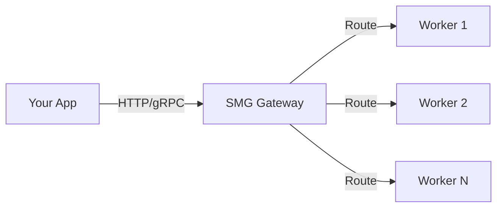

# Getting Started with SMG

This section helps you install Shepherd Model Gateway and run your first deployment.

#### What you'll accomplish

- Install SMG using Docker, pre-built binaries, or from source
- Deploy a basic gateway with one or more workers
- Send your first inference request through the gateway

## Overview

Shepherd Model Gateway (SMG) is a routing layer that sits between your applications and LLM inference workers. It handles:

- **Load balancing** across multiple workers
- **Reliability** through circuit breakers and retries
- **Observability** with metrics and tracing
- **Protocol translation** between HTTP, gRPC, and OpenAI-compatible APIs

## Prerequisites

Before installing SMG, ensure you have:

- [ ] **Docker** (recommended) or a Linux/macOS system for binary installation
- [ ] **At least one LLM inference worker** running (e.g., SGLang, vLLM, or any OpenAI-compatible server)
- [ ] **Network connectivity** between SMG and your workers

## Next Steps

### Installation

Install SMG using your preferred method.

[Install SMG →](installation.md)

### Quickstart

Get SMG running in under 5 minutes.

[Start the Quickstart →](quickstart.md)

## Architecture at a Glance

SMG consists of two main components:

| Component | Purpose |
|-----------|---------|
| **Control Plane** | Manages worker lifecycle, health checks, and service discovery |
| **Data Plane** | Routes requests, handles retries, and streams responses |

To learn more about how SMG works internally, see the [Architecture Concepts](../concepts/architecture/overview.md).
