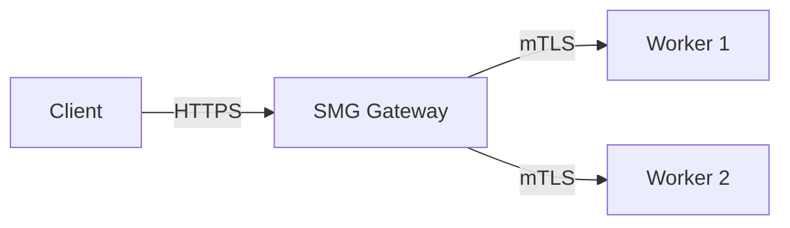

# Configure TLS

This task shows you how to secure SMG communications with TLS and mTLS.

<div class="prerequisites" markdown>

#### Before you begin

- SMG [installed](../../getting-started/installation.md)
- TLS certificates (or follow the steps below to generate them)

</div>

---

## Overview

SMG supports two TLS configurations:

| Configuration | Purpose |
|---------------|---------|
| **Server TLS** | HTTPS for client → gateway communication |
| **Client mTLS** | Mutual TLS for gateway → worker communication |



---

## Generate Certificates

For testing, generate self-signed certificates:

### Step 1: Create CA

```bash
# Generate CA private key
openssl genrsa -out ca.key 4096

# Generate CA certificate
openssl req -new -x509 -days 365 -key ca.key -out ca.crt \
  -subj "/CN=SMG CA/O=SMG"
```

### Step 2: Create server certificate

```bash
# Generate server private key
openssl genrsa -out server.key 2048

# Generate server CSR
openssl req -new -key server.key -out server.csr \
  -subj "/CN=smg.example.com/O=SMG"

# Sign with CA
openssl x509 -req -days 365 -in server.csr \
  -CA ca.crt -CAkey ca.key -CAcreateserial \
  -out server.crt
```

### Step 3: Create client certificate

```bash
# Generate client private key
openssl genrsa -out client.key 2048

# Generate client CSR
openssl req -new -key client.key -out client.csr \
  -subj "/CN=smg-client/O=SMG"

# Sign with CA
openssl x509 -req -days 365 -in client.csr \
  -CA ca.crt -CAkey ca.key -CAcreateserial \
  -out client.crt
```

---

## Enable Server TLS

Serve the gateway over HTTPS.

### Configuration

```bash
smg \
  --worker-urls http://worker:8000 \
  --tls-cert-path /path/to/server.crt \
  --tls-key-path /path/to/server.key \
  --host 0.0.0.0 \
  --port 443
```

### Verification

```bash
curl --cacert ca.crt https://smg.example.com/health
```

---

## Enable Client mTLS

Secure communication with workers.

### Configuration

```bash
smg \
  --worker-urls https://worker1:8443 https://worker2:8443 \
  --client-cert-path /path/to/client.crt \
  --client-key-path /path/to/client.key \
  --ca-cert-path /path/to/ca.crt
```

### Multiple CA certificates

```bash
smg \
  --worker-urls https://worker:8443 \
  --client-cert-path /path/to/client.crt \
  --client-key-path /path/to/client.key \
  --ca-cert-path /path/to/ca1.crt \
  --ca-cert-path /path/to/ca2.crt
```

---

## Full TLS Configuration

Enable both server TLS and client mTLS:

```bash
smg \
  --worker-urls https://worker1:8443 https://worker2:8443 \
  --tls-cert-path /etc/certs/server.crt \
  --tls-key-path /etc/certs/server.key \
  --client-cert-path /etc/certs/client.crt \
  --client-key-path /etc/certs/client.key \
  --ca-cert-path /etc/certs/ca.crt \
  --api-key "${API_KEY}" \
  --host 0.0.0.0 \
  --port 443
```

---

## Kubernetes with cert-manager

Use cert-manager for automatic certificate management.

### Step 1: Install cert-manager

```bash
kubectl apply -f https://github.com/cert-manager/cert-manager/releases/download/v1.14.0/cert-manager.yaml
```

### Step 2: Create Certificate

```yaml title="smg-certificate.yaml"
apiVersion: cert-manager.io/v1
kind: Certificate
metadata:
  name: smg-tls
  namespace: inference
spec:
  secretName: smg-tls-secret
  issuerRef:
    name: letsencrypt-prod
    kind: ClusterIssuer
  dnsNames:
    - smg.example.com
```

### Step 3: Mount in deployment

```yaml
spec:
  containers:
    - name: smg
      volumeMounts:
        - name: tls-certs
          mountPath: /etc/certs
          readOnly: true
      args:
        - --tls-cert-path
        - /etc/certs/tls.crt
        - --tls-key-path
        - /etc/certs/tls.key
  volumes:
    - name: tls-certs
      secret:
        secretName: smg-tls-secret
```

---

## Verification

### Test server TLS

```bash
# With CA certificate
curl --cacert ca.crt https://smg.example.com/health

# Check certificate details
openssl s_client -connect smg.example.com:443 -showcerts
```

### Test client mTLS

```bash
# From SMG logs
kubectl logs -n inference -l app=smg | grep -i tls

# Verify worker connection
curl https://localhost:30000/workers
```

---

## Troubleshooting

??? question "Certificate verification failed"

    1. Verify CA certificate matches:
    ```bash
    openssl verify -CAfile ca.crt server.crt
    ```

    2. Check certificate expiration:
    ```bash
    openssl x509 -in server.crt -noout -dates
    ```

    3. Verify hostname matches:
    ```bash
    openssl x509 -in server.crt -noout -text | grep DNS
    ```

??? question "Connection refused"

    1. Check SMG is listening on correct port:
    ```bash
    netstat -tlnp | grep smg
    ```

    2. Verify TLS configuration in logs:
    ```bash
    smg --tls-cert-path ... 2>&1 | grep -i tls
    ```

??? question "Handshake failure"

    1. Check TLS version compatibility
    2. Verify cipher suite support
    3. Ensure certificate chain is complete

---

## What's Next?

- [Monitor with Prometheus](../operations/monitoring.md) — Set up observability
- [Security Concepts](../../concepts/reliability/rate-limiting.md) — Learn about rate limiting
