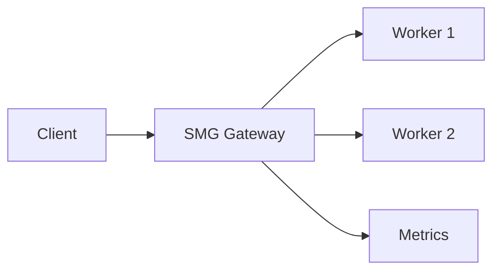

# Tutorial: Getting Started with SMG

This tutorial walks you through building your first SMG deployment. You'll learn the fundamentals of load balancing inference requests across multiple workers.

<div class="objectives" markdown>

#### What you'll learn

- How to deploy SMG with Docker
- How to configure multiple workers
- How to use different load balancing policies
- How to monitor your deployment

</div>

<div class="prerequisites" markdown>

#### Before you begin

- Docker and Docker Compose installed
- 16GB+ RAM recommended
- Basic familiarity with REST APIs
- (Optional) GPU for running real inference workers

</div>

---

## Overview

In this tutorial, you'll build this architecture:



You'll use mock workers for this tutorial, so no GPU is required.

---

## Step 1: Set Up the Project

Create a directory for your tutorial:

```bash
mkdir smg-tutorial
cd smg-tutorial
```

---

## Step 2: Create Mock Workers

For this tutorial, we'll create simple mock workers that simulate inference responses.

Create `mock-worker.py`:

```python title="mock-worker.py"
"""Simple mock inference worker for testing SMG."""

import json
import time
import random
from http.server import HTTPServer, BaseHTTPRequestHandler

class MockWorker(BaseHTTPRequestHandler):
    def do_GET(self):
        if self.path == '/health':
            self.send_response(200)
            self.send_header('Content-Type', 'application/json')
            self.end_headers()
            self.wfile.write(json.dumps({'status': 'healthy'}).encode())
        elif self.path == '/v1/models':
            self.send_response(200)
            self.send_header('Content-Type', 'application/json')
            self.end_headers()
            response = {
                'data': [{'id': 'mock-model', 'object': 'model'}]
            }
            self.wfile.write(json.dumps(response).encode())
        else:
            self.send_response(404)
            self.end_headers()

    def do_POST(self):
        if self.path == '/v1/chat/completions':
            content_length = int(self.headers.get('Content-Length', 0))
            body = self.rfile.read(content_length)
            request = json.loads(body)

            # Simulate processing time
            time.sleep(random.uniform(0.1, 0.3))

            self.send_response(200)
            self.send_header('Content-Type', 'application/json')
            self.end_headers()

            response = {
                'id': f'mock-{random.randint(1000, 9999)}',
                'object': 'chat.completion',
                'model': request.get('model', 'mock-model'),
                'choices': [{
                    'index': 0,
                    'message': {
                        'role': 'assistant',
                        'content': 'Hello! This is a mock response from the inference worker.'
                    },
                    'finish_reason': 'stop'
                }],
                'usage': {
                    'prompt_tokens': 10,
                    'completion_tokens': 15,
                    'total_tokens': 25
                }
            }
            self.wfile.write(json.dumps(response).encode())
        else:
            self.send_response(404)
            self.end_headers()

    def log_message(self, format, *args):
        print(f"[Worker] {args[0]}")

if __name__ == '__main__':
    import sys
    port = int(sys.argv[1]) if len(sys.argv) > 1 else 8000
    server = HTTPServer(('0.0.0.0', port), MockWorker)
    print(f"Mock worker running on port {port}")
    server.serve_forever()
```

---

## Step 3: Create Docker Compose Configuration

Create `docker-compose.yml`:

```yaml title="docker-compose.yml"
version: '3.8'

services:
  # SMG Gateway
  smg:
    image: lightseekorg/smg:latest
    container_name: smg-gateway
    ports:
      - "30000:30000"  # API
      - "29000:29000"  # Metrics
    command:
      - --worker-urls
      - http://worker1:8000
      - http://worker2:8000
      - --policy
      - round_robin
      - --prometheus-port
      - "29000"
      - --host
      - "0.0.0.0"
    depends_on:
      - worker1
      - worker2
    healthcheck:
      test: ["CMD", "curl", "-f", "http://localhost:30000/health"]
      interval: 10s
      timeout: 5s
      retries: 3

  # Mock Worker 1
  worker1:
    build:
      context: .
      dockerfile: Dockerfile.worker
    container_name: mock-worker-1
    environment:
      - WORKER_ID=worker1

  # Mock Worker 2
  worker2:
    build:
      context: .
      dockerfile: Dockerfile.worker
    container_name: mock-worker-2
    environment:
      - WORKER_ID=worker2
```

Create `Dockerfile.worker`:

```dockerfile title="Dockerfile.worker"
FROM python:3.11-slim

WORKDIR /app
COPY mock-worker.py .

EXPOSE 8000

CMD ["python", "mock-worker.py", "8000"]
```

---

## Step 4: Start the Deployment

Build and start all services:

```bash
docker compose up -d --build
```

Check all services are running:

```bash
docker compose ps
```

Expected output:

```
NAME             STATUS          PORTS
mock-worker-1    Up              8000/tcp
mock-worker-2    Up              8000/tcp
smg-gateway      Up              0.0.0.0:29000->29000/tcp, 0.0.0.0:30000->30000/tcp
```

---

## Step 5: Verify the Deployment

### Check SMG Health

```bash
curl http://localhost:30000/health
```

Expected response:

```json
{"status": "ok"}
```

### List Workers

```bash
curl http://localhost:30000/workers
```

Expected response:

```json
{
  "workers": [
    {"url": "http://worker1:8000", "healthy": true},
    {"url": "http://worker2:8000", "healthy": true}
  ],
  "total": 2,
  "healthy": 2
}
```

---

## Step 6: Send Your First Request

Send a chat completion request:

```bash
curl http://localhost:30000/v1/chat/completions \
  -H "Content-Type: application/json" \
  -d '{
    "model": "mock-model",
    "messages": [
      {"role": "user", "content": "Hello, world!"}
    ]
  }'
```

Expected response:

```json
{
  "id": "mock-1234",
  "object": "chat.completion",
  "model": "mock-model",
  "choices": [{
    "index": 0,
    "message": {
      "role": "assistant",
      "content": "Hello! This is a mock response from the inference worker."
    },
    "finish_reason": "stop"
  }],
  "usage": {
    "prompt_tokens": 10,
    "completion_tokens": 15,
    "total_tokens": 25
  }
}
```

---

## Step 7: Explore Load Balancing

Send multiple requests and observe distribution:

```bash
for i in {1..10}; do
  curl -s http://localhost:30000/v1/chat/completions \
    -H "Content-Type: application/json" \
    -d '{"model": "mock-model", "messages": [{"role": "user", "content": "Test"}]}' \
    > /dev/null
  echo "Request $i sent"
done
```

Check the worker logs to see requests distributed:

```bash
docker compose logs worker1 worker2 | grep -c "POST"
```

You should see requests split roughly evenly between workers.

---

## Step 8: Try Different Policies

### Random Policy

```bash
docker compose down
```

Edit `docker-compose.yml` and change `--policy round_robin` to `--policy random`.

```bash
docker compose up -d
```

### Cache-Aware Policy

For production LLM workloads, cache-aware routing maximizes KV cache hits:

```yaml
command:
  - --worker-urls
  - http://worker1:8000
  - http://worker2:8000
  - --policy
  - cache_aware
```

---

## Step 9: View Metrics

Check Prometheus metrics:

```bash
curl http://localhost:29000/metrics
```

Key metrics to look for:

```
# Request count
smg_requests_total{method="POST",path="/v1/chat/completions",status="200"}

# Request latency
smg_request_duration_seconds_bucket

# Worker health
smg_worker_health{worker="http://worker1:8000"}
```

---

## Step 10: Simulate Worker Failure

Stop one worker:

```bash
docker compose stop worker2
```

Check worker status:

```bash
curl http://localhost:30000/workers
```

Worker2 should show as unhealthy. Send more requests:

```bash
for i in {1..5}; do
  curl -s http://localhost:30000/v1/chat/completions \
    -H "Content-Type: application/json" \
    -d '{"model": "mock-model", "messages": [{"role": "user", "content": "Test"}]}'
done
```

All requests should be routed to worker1.

Restart worker2:

```bash
docker compose start worker2
```

---

## Clean Up

Remove all tutorial resources:

```bash
docker compose down -v
cd ..
rm -rf smg-tutorial
```

---

## What You Learned

In this tutorial, you:

- [x] Deployed SMG with Docker Compose
- [x] Configured multiple inference workers
- [x] Sent requests through the gateway
- [x] Explored different load balancing policies
- [x] Viewed Prometheus metrics
- [x] Observed automatic failover

---

## Next Steps

Now that you understand the basics:

- **[Production Deployment Tutorial](production.md)** — Deploy to Kubernetes with HA
- **[Load Balancing Concepts](../concepts/routing/load-balancing.md)** — Deep dive into policies
- **[Cache-Aware Routing](../concepts/routing/cache-aware.md)** — Optimize for LLM workloads
