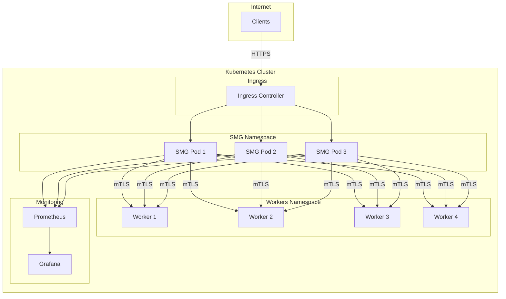

# Tutorial: Production Deployment

This tutorial walks you through deploying a production-ready SMG cluster on Kubernetes with high availability, monitoring, and security.

<div class="objectives" markdown>

#### What you'll learn

- Deploy SMG with high availability
- Configure Kubernetes service discovery
- Set up TLS encryption
- Implement monitoring and alerting
- Configure autoscaling

</div>

<div class="prerequisites" markdown>

#### Before you begin

- Kubernetes cluster (1.24+)
- `kubectl` configured
- `helm` installed
- Basic Kubernetes knowledge
- Completed [Getting Started tutorial](getting-started.md)

</div>

---

## Overview

You'll build this production architecture:



---

## Step 1: Create Namespaces

```bash
kubectl create namespace smg-system
kubectl create namespace inference
```

---

## Step 2: Deploy Mock Workers

For this tutorial, we'll deploy mock workers. In production, replace these with real inference workers.

```yaml title="workers.yaml"
apiVersion: apps/v1
kind: Deployment
metadata:
  name: mock-worker
  namespace: inference
spec:
  replicas: 4
  selector:
    matchLabels:
      app: sglang-worker
  template:
    metadata:
      labels:
        app: sglang-worker
    spec:
      containers:
        - name: worker
          image: python:3.11-slim
          ports:
            - containerPort: 8000
          command:
            - python
            - -c
            - |
              import json
              from http.server import HTTPServer, BaseHTTPRequestHandler

              class Handler(BaseHTTPRequestHandler):
                  def do_GET(self):
                      if self.path == '/health':
                          self.send_response(200)
                          self.send_header('Content-Type', 'application/json')
                          self.end_headers()
                          self.wfile.write(b'{"status":"healthy"}')
                      elif self.path == '/v1/models':
                          self.send_response(200)
                          self.send_header('Content-Type', 'application/json')
                          self.end_headers()
                          self.wfile.write(b'{"data":[{"id":"mock-model"}]}')

                  def do_POST(self):
                      self.send_response(200)
                      self.send_header('Content-Type', 'application/json')
                      self.end_headers()
                      response = {
                          "id": "mock-123",
                          "choices": [{"message": {"content": "Mock response"}}]
                      }
                      self.wfile.write(json.dumps(response).encode())

              HTTPServer(('0.0.0.0', 8000), Handler).serve_forever()
          readinessProbe:
            httpGet:
              path: /health
              port: 8000
            initialDelaySeconds: 5
            periodSeconds: 10
          resources:
            requests:
              cpu: "100m"
              memory: "128Mi"
            limits:
              cpu: "500m"
              memory: "256Mi"
---
apiVersion: v1
kind: Service
metadata:
  name: mock-worker
  namespace: inference
spec:
  selector:
    app: sglang-worker
  ports:
    - port: 8000
      targetPort: 8000
  clusterIP: None  # Headless service for service discovery
```

Apply the workers:

```bash
kubectl apply -f workers.yaml
```

Verify workers are running:

```bash
kubectl get pods -n inference -l app=sglang-worker
```

---

## Step 3: Configure RBAC

SMG needs permissions to discover workers:

```yaml title="rbac.yaml"
apiVersion: v1
kind: ServiceAccount
metadata:
  name: smg
  namespace: smg-system
---
apiVersion: rbac.authorization.k8s.io/v1
kind: Role
metadata:
  name: smg-worker-discovery
  namespace: inference
rules:
  - apiGroups: [""]
    resources: ["pods"]
    verbs: ["get", "list", "watch"]
---
apiVersion: rbac.authorization.k8s.io/v1
kind: RoleBinding
metadata:
  name: smg-worker-discovery
  namespace: inference
subjects:
  - kind: ServiceAccount
    name: smg
    namespace: smg-system
roleRef:
  kind: Role
  name: smg-worker-discovery
  apiGroup: rbac.authorization.k8s.io
```

Apply RBAC:

```bash
kubectl apply -f rbac.yaml
```

---

## Step 4: Generate TLS Certificates

For production, use cert-manager. For this tutorial, we'll create self-signed certificates:

```bash
# Create CA
openssl genrsa -out ca.key 4096
openssl req -new -x509 -days 365 -key ca.key -out ca.crt \
  -subj "/CN=SMG CA/O=Tutorial"

# Create server certificate
openssl genrsa -out server.key 2048
openssl req -new -key server.key -out server.csr \
  -subj "/CN=smg.smg-system.svc/O=Tutorial"
openssl x509 -req -days 365 -in server.csr \
  -CA ca.crt -CAkey ca.key -CAcreateserial \
  -out server.crt

# Create Kubernetes secret
kubectl create secret tls smg-tls \
  --cert=server.crt \
  --key=server.key \
  -n smg-system

kubectl create secret generic smg-ca \
  --from-file=ca.crt=ca.crt \
  -n smg-system
```

---

## Step 5: Deploy SMG

```yaml title="smg-deployment.yaml"
apiVersion: apps/v1
kind: Deployment
metadata:
  name: smg
  namespace: smg-system
  labels:
    app: smg
spec:
  replicas: 3
  selector:
    matchLabels:
      app: smg
  template:
    metadata:
      labels:
        app: smg
      annotations:
        prometheus.io/scrape: "true"
        prometheus.io/port: "29000"
    spec:
      serviceAccountName: smg
      affinity:
        podAntiAffinity:
          preferredDuringSchedulingIgnoredDuringExecution:
            - weight: 100
              podAffinityTerm:
                labelSelector:
                  matchLabels:
                    app: smg
                topologyKey: kubernetes.io/hostname
      containers:
        - name: smg
          image: lightseekorg/smg:latest
          ports:
            - containerPort: 30000
              name: http
            - containerPort: 29000
              name: metrics
          args:
            - --service-discovery
            - --selector
            - app=sglang-worker
            - --service-discovery-namespace
            - inference
            - --service-discovery-port
            - "8000"
            - --policy
            - cache_aware
            - --host
            - "0.0.0.0"
            - --port
            - "30000"
            - --prometheus-port
            - "29000"
            - --max-concurrent-requests
            - "100"
            - --queue-size
            - "200"
          env:
            - name: RUST_LOG
              value: "info"
          livenessProbe:
            httpGet:
              path: /health
              port: 30000
            initialDelaySeconds: 10
            periodSeconds: 30
            timeoutSeconds: 5
          readinessProbe:
            httpGet:
              path: /readiness
              port: 30000
            initialDelaySeconds: 5
            periodSeconds: 10
            timeoutSeconds: 5
          resources:
            requests:
              cpu: "500m"
              memory: "512Mi"
            limits:
              cpu: "2"
              memory: "2Gi"
---
apiVersion: v1
kind: Service
metadata:
  name: smg
  namespace: smg-system
  labels:
    app: smg
spec:
  selector:
    app: smg
  ports:
    - name: http
      port: 80
      targetPort: 30000
    - name: metrics
      port: 9090
      targetPort: 29000
  type: ClusterIP
```

Apply the deployment:

```bash
kubectl apply -f smg-deployment.yaml
```

Verify pods are running:

```bash
kubectl get pods -n smg-system -l app=smg
```

---

## Step 6: Configure Autoscaling

```yaml title="hpa.yaml"
apiVersion: autoscaling/v2
kind: HorizontalPodAutoscaler
metadata:
  name: smg
  namespace: smg-system
spec:
  scaleTargetRef:
    apiVersion: apps/v1
    kind: Deployment
    name: smg
  minReplicas: 3
  maxReplicas: 10
  metrics:
    - type: Resource
      resource:
        name: cpu
        target:
          type: Utilization
          averageUtilization: 70
    - type: Resource
      resource:
        name: memory
        target:
          type: Utilization
          averageUtilization: 80
```

Apply HPA:

```bash
kubectl apply -f hpa.yaml
```

---

## Step 7: Set Up Monitoring

### Deploy Prometheus

```yaml title="prometheus.yaml"
apiVersion: v1
kind: ConfigMap
metadata:
  name: prometheus-config
  namespace: smg-system
data:
  prometheus.yml: |
    global:
      scrape_interval: 15s

    scrape_configs:
      - job_name: 'smg'
        kubernetes_sd_configs:
          - role: pod
            namespaces:
              names:
                - smg-system
        relabel_configs:
          - source_labels: [__meta_kubernetes_pod_label_app]
            regex: smg
            action: keep
          - source_labels: [__meta_kubernetes_pod_container_port_name]
            regex: metrics
            action: keep
---
apiVersion: apps/v1
kind: Deployment
metadata:
  name: prometheus
  namespace: smg-system
spec:
  replicas: 1
  selector:
    matchLabels:
      app: prometheus
  template:
    metadata:
      labels:
        app: prometheus
    spec:
      containers:
        - name: prometheus
          image: prom/prometheus:v2.48.0
          ports:
            - containerPort: 9090
          volumeMounts:
            - name: config
              mountPath: /etc/prometheus
          args:
            - --config.file=/etc/prometheus/prometheus.yml
            - --storage.tsdb.path=/prometheus
      volumes:
        - name: config
          configMap:
            name: prometheus-config
---
apiVersion: v1
kind: Service
metadata:
  name: prometheus
  namespace: smg-system
spec:
  selector:
    app: prometheus
  ports:
    - port: 9090
      targetPort: 9090
```

Apply Prometheus:

```bash
kubectl apply -f prometheus.yaml
```

---

## Step 8: Configure Ingress

```yaml title="ingress.yaml"
apiVersion: networking.k8s.io/v1
kind: Ingress
metadata:
  name: smg
  namespace: smg-system
  annotations:
    nginx.ingress.kubernetes.io/proxy-body-size: "100m"
    nginx.ingress.kubernetes.io/proxy-read-timeout: "600"
    nginx.ingress.kubernetes.io/proxy-send-timeout: "600"
spec:
  ingressClassName: nginx
  rules:
    - host: smg.example.com
      http:
        paths:
          - path: /
            pathType: Prefix
            backend:
              service:
                name: smg
                port:
                  number: 80
  tls:
    - hosts:
        - smg.example.com
      secretName: smg-tls
```

Apply ingress:

```bash
kubectl apply -f ingress.yaml
```

---

## Step 9: Verify the Deployment

### Check All Resources

```bash
kubectl get all -n smg-system
kubectl get all -n inference
```

### Port Forward for Testing

```bash
kubectl port-forward -n smg-system svc/smg 30000:80 &
```

### Test the API

```bash
# Health check
curl http://localhost:30000/health

# List workers
curl http://localhost:30000/workers

# Send request
curl http://localhost:30000/v1/chat/completions \
  -H "Content-Type: application/json" \
  -d '{
    "model": "mock-model",
    "messages": [{"role": "user", "content": "Hello"}]
  }'
```

### Check Metrics

```bash
kubectl port-forward -n smg-system svc/prometheus 9090:9090 &
```

Open http://localhost:9090 and query `smg_requests_total`.

---

## Step 10: Load Test

Run a simple load test:

```bash
# Install hey if not available
# brew install hey  # macOS
# apt install hey   # Ubuntu

hey -n 1000 -c 50 -m POST \
  -H "Content-Type: application/json" \
  -d '{"model":"mock-model","messages":[{"role":"user","content":"Test"}]}' \
  http://localhost:30000/v1/chat/completions
```

Watch the HPA respond:

```bash
kubectl get hpa -n smg-system -w
```

---

## Clean Up

Remove all tutorial resources:

```bash
kubectl delete namespace smg-system
kubectl delete namespace inference
rm -f ca.* server.* *.yaml
```

---

## What You Learned

In this tutorial, you:

- [x] Deployed SMG with high availability (3 replicas)
- [x] Configured Kubernetes service discovery
- [x] Set up TLS certificates
- [x] Implemented pod anti-affinity for resilience
- [x] Configured horizontal pod autoscaling
- [x] Deployed Prometheus monitoring
- [x] Created an Ingress for external access
- [x] Performed load testing

---

## Production Checklist

Before going to production, ensure you have:

- [ ] **TLS**: Use cert-manager with Let's Encrypt
- [ ] **Secrets**: Use external secrets management (Vault, AWS Secrets Manager)
- [ ] **Monitoring**: Set up alerts for error rates, latency, and worker health
- [ ] **Logging**: Configure log aggregation (Loki, Elasticsearch)
- [ ] **Backups**: Document recovery procedures
- [ ] **Rate Limiting**: Configure appropriate limits for your workload
- [ ] **Network Policies**: Restrict pod-to-pod communication

---

## Next Steps

- **[Configure TLS](../tasks/deployment/tls.md)** — Production TLS with cert-manager
- **[Monitor with Prometheus](../tasks/operations/monitoring.md)** — Advanced monitoring setup
- **[Rate Limiting](../concepts/reliability/rate-limiting.md)** — Protect your workers
